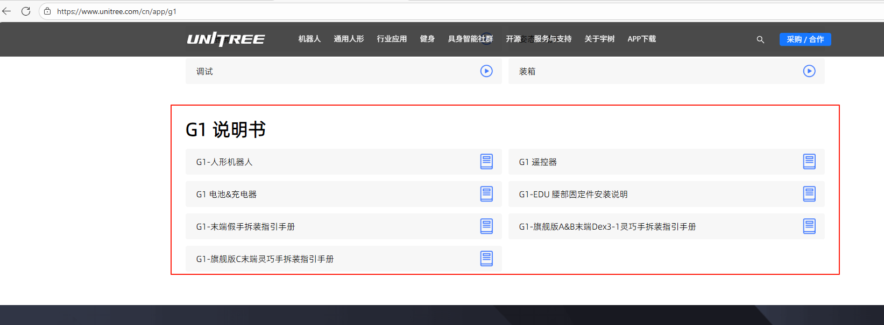
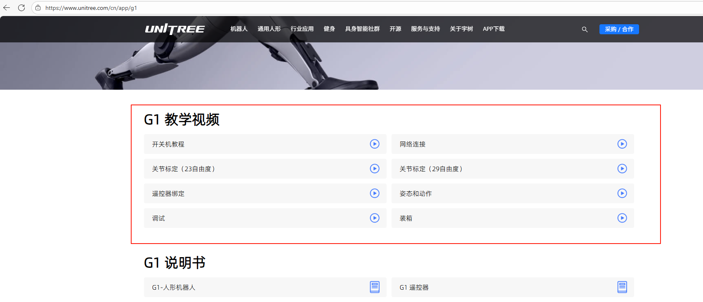

<!--
 * @Author: error: error: git config user.name & please set dead value or install git && error: git config user.email & please set dead value or install git & please set dead value or install git
 * @Date: 2025-12-02 14:26:22
 * @LastEditors: error: error: git config user.name & please set dead value or install git && error: git config user.email & please set dead value or install git & please set dead value or install git
 * @LastEditTime: 2025-12-02 14:28:13
 * @FilePath: \Ethan_Ye_workspace\G1_Userguide_for_lab_of_FSII\README.md
 * @Description: 这是默认设置,请设置`customMade`, 打开koroFileHeader查看配置 进行设置: https://github.com/OBKoro1/koro1FileHeader/wiki/%E9%85%8D%E7%BD%AE
-->
# 🤖G1_Userguide_for_lab_of_FSII

*A developer-oriented Unitree-G1-U2 development manual prepared for FSII. It covers the robot’s mechanical structure, operating instructions, application-level development, low-level motion control, high-level motion development, and practical examples. The content is organized and adapted from official Unitree Robotics documentation.*

----------

**本使用手册针对课题组内部开发者使用，所有资料均来自官方。  
⚠️ 本机器人型号为G1进阶版（G1-edu-U2），请各位开发者注意甄别。**
## 📚产品资料  
[宇树官网 Unitree official website](https://www.unitree.com/cn/g1)

[G1产品资料&开发资料](https://serviceconsole.unitree.com/#/help/031301)  

[G1 SDK 开发指南](https://support.unitree.com/home/zh/G1_developer/about_G1)


[G1 说明书（App下载页面最下面）](https://www.unitree.com/cn/app/g1)


[G1 教学视频（App下载页面下面）](https://www.unitree.com/cn/app/g1)

## 🕹️调试模式
当 G1 处于悬挂状态下，并且处于阻尼状态，同时按下遥控器 L2 + R2 组合键，G1 进入调试模式。此时按下 L2 + A ，G1 会进入位置模式，摆出特定诊断姿势。  
（再按 L2 + B，G1 进入阻尼状态。此过程可以用于确认 G1 是否成功进入调试模式，或者用于硬件故障排查。此时可以开始使用 SDK 进行开发调试。）

## 🔗连接方式
G1-EDU 机载标配 1 块【运控计算单元】，并且标配一块【开发计算单元】。
【运控计算单元】为 Unitree 运动控制程序专用，不对外开放。开发者仅可使用【开发计算单元】进行二次开发。
在开发文档或者技术支持过程中，【运控计算单元】会被表述为PC2，相对的，【运控计算单元】一般表述为PC1。  
**【开发计算单元】，地址为 192.168.123.164，用户名：unitree，密码：123。**

```
{
#ssh
ssh unitree@192.168.123.164
#密码123
}
```
| 参数    | 运控计算单元（PC1） |开发计算单元（PC2） |
| ----------- | :-----------: |:-----------: |
| 型号     | 不提供      |Jetson Orin NX 16G，100TOPS |
| CPU   | 8核CPU        |Arm® Cortex®-A78AE      |
|显存	|    -	        |        16G |
|内存	|   -	          |      16G |
|存储	|    -	            |     2T    |
|IP地址	| 192.168.123.161	|192.168.123.164|
|用户名	|不开放	|unitree|
|密码	|不开放	|123|

## ⚙️图纸与模型  

G1 三维简化模型（开发文档 - 应用开发 - 获取SDK）：  
https://support.unitree.com/home/zh/G1_developer/get_sdk  
G1 URDF：  
https://github.com/unitreerobotics/unitree_ros/tree/master/robots/g1_description  
G1 URDF 版本选择：  
https://serviceconsole.unitree.com/#/help/031305  
G1 机身安装孔位（开发文档 - 关于G1 - 安装孔位）：  
https://support.unitree.com/home/zh/G1_developer/about_G1  
G1进阶版末端图纸：  
https://oss-global-cdn.unitree.com/static/975886fe20e04283a0cbd06cd8d0f88c.zip


## 🔍其他支持
🔧宇树售后服务
https://serviceconsole.unitree.com/index.html#/  
文档维护和技术支持请联系（wechat）  
+86-13958582557  
